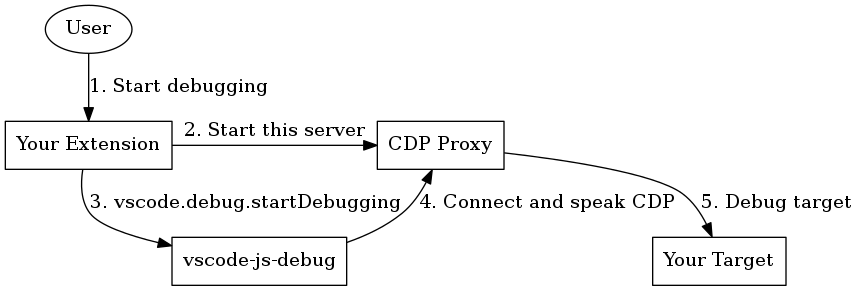

# vscode-cdp-proxy

Sample Chrome Debug Protocol proxy used to extend `vscode-js-debug` with custom targets. This can be used to allow js-debug to work with esoteric targets, like WebAssembly-compiled and frameworks like React Native. Say you're building a React Native debugger. The general flow would work like so:



1. You have a React Native extension, which allows users to start debugging via a command or a launch config.
2. When a session starts, you start a CDP proxy, like the one in this repo. Say it starts listening on `localhost:3000`
3. Then, you call [`vscode.debug.startDebugger`](https://code.visualstudio.com/api/references/vscode-api#debug.startDebugging) with a configuration like:

   ```js
   {
     "type": "pwa-chrome",
     "request": "attach",
     "address": "localhost",  // <- host your proxy is running on
     "port": 3000,            // <- port your proxy is running on
   }
   ```

4. The debugger will then connect to the proxy like it would any other CDP-enabled target.
5. Finally, you translate between CDP and the protocol used to debug your target application. In the case of React Native, this is might be a minimal rewrite of some CDP behavior. In the case of more advanced WebAssembly targets, you might translate into something entirely new.

## Using this Package

Parts of this package are exported from [js-debug](https://github.com/microsoft/vscode-js-debug). We may publish these parts as nicely packaged bits for reuse here and in the extension, but that's not done right now.

Check out `demo.js` for an example of a server.
